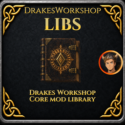

# DrakeModsLibs

Shared library for **DrakeMods** Valheim mods. It owns the display Harmony patches, item custom-data helpers, tag gatekeeping, menu binding registry, and **server config sync** so feature mods stay smaller and stay compatible when the game updates.

**DrakeModsLibs** is published on its own so other DrakeMods (starting with **DrakesRenameit**) can depend on one common package. More customization-oriented mods may use it later; there is **no full suite planned for release right now** — priorities and a redesign pass come first. **Reskin** is something we still want to look into when time allows.

## Valheim 1.0

This release targets **Valheim 1.0** API changes (notably item-stand visual updates and related display paths). Install the matching **DrakeModsLibs** build with your feature mods so labels and hover text keep working after the 1.0 update.

## Required for

- **LockSmith** (ArtItemLoader for the Locksmith Key pack)
- **DrakesRenameit** (and any future DrakeMods that share display / config sync)

## Art items (ArtItemLoader)

Consumer mods call `ArtItemLoader.Register(log, pluginDir, config, customize)` from `Awake`. Layouts:

- **Folder pack:** `Assets/Items/keys/keys.bundle` + `masterkey.json` / `masterkey.png` (shared bundle, many items)
- **Legacy:** `Assets/Items/<id>/item.json` + `art.bundle`

Optional `customize` can set name, recipe, scale, materials, or `UseDonorVisual` (keep CryptKey mesh, retint only).

## Server config sync (DrakeConfigSync)

**Only DrakeModsLibs** references and ILRepack-embeds [ServerSync](https://github.com/MSchmoecker/ServerSync). Consumer mods must not add a ServerSync Thunderstore dependency or ILRepack step.

At startup, create sync via the API:

```csharp
var sync = CustomizeLibsAPI.CreateConfigSync(modId, displayName, version);
var entry = sync.BindSynced(config, section, configurationManagerCategory, key, defaultValue, description);
sync.AddLockingConfigEntry(lockEntry);
sync.FinalizeBinding(log, expectedSyncedEntryCount, () => lockEntry.Value);
```

Use `BindClientOnly` for per-client settings (never registered with ServerSync). `IsSourceOfTruth` / `SourceOfTruthChanged` behave like the underlying ServerSync instance.

## Soft-compat (CompatHost)

Optional foreign mods (WardIsLove, ProtectiveWards, Arcane Ward, DevCommands, …) are **never** hard dependencies. DrakeModsLibs provides per-plugin scaffolding:

- `DrakeModsLibs.Compat.ICompatModule` / `CompatPriority`
- `CompatHost` / `CompatHosts.GetOrCreate(ownerGuid, log)` — **one host per Drake plugin GUID**

Domain rules (ward access, paper take, item-stand names) stay in **LockSmith** / **RenameIt**. Built-in bridges there are a courtesy — not a promise to track every upstream ward change. Please report issues on those repos; pull requests and your own SoftDependency modules are welcome. LockSmith also exposes `LockSmithCompatApi` for third-party bridges.

Agent guidance: `.cursor/skills/drakemods-compat-host/SKILL.md`. WardIsLove RenameIt handover: [`docs/handover-wardislove-renameit.md`](docs/handover-wardislove-renameit.md).

## Custom data API (other mods)

Read and dump `ItemDrop.ItemData.m_customData` through `CustomizeLibsAPI`:

- `GetCustomDataValue(item, key)` — display value (tags → `true`/null, text → stored string)
- `GetCustomDataRaw(item, key)` — raw dictionary value
- `DumpItemCustomData(item, options)` — all keys, one mod, one key, JSON or neat text
- `DumpAllDrakeCustomData(item)` / `DumpItemCustomDataForMod(item, modId)`
- `RegisterModCustomDataFields(modId, fields)` — register your mod’s keys at startup

Built-in mod ids: `DrakesRenameIt`, `DrakeModsLibs`, `DrakesQuestItems`, `DrakesItemShop`.

Subscribe to `CustomizationEvents.OnItemNameChanged` for rename logging; use `DrakeCustomDataKeys.Rename` with `GetCustomDataValue`.

## Tag gates (RenameIt integration)

Other mods talk to **Libs only**; RenameIt calls `CanPerform` / `IsRenameInventorySuppressed` and never needs a new release for your tags.

| Built-in tag | Blocks | Inventory UI | Admin bypass |
|--------------|--------|--------------|--------------|
| `Drake_NoRename` | rename | suppress | soft (yes) |
| `Drake_NoDesc` | description | — | soft (yes) |
| `Drake_NoCraftedByEdit` | crafted-by | — | soft (yes) |
| `Drake_QuestItem` | all edits | suppress | soft (yes) |
| `Drake_HardNoRename` | rename | suppress | **hard (no)** |
| `Drake_HardNoDesc` | description | suppress | **hard (no)** |
| `Drake_HardNoCraftedBy` | crafted-by | suppress | **hard (no)** |
| `Drake_Immutable` | all edits | suppress | **hard (no)** |
| Deferred (`DeferEditsTo`) | chosen ops | optional | **authority decides** |

```csharp
// Soft stamp (admin/VIP TagBypass may still allow)
CustomizeLibsAPI.BlockRename(item);

// Hard stamp (LockSmith-style safety — no admin bypass)
CustomizeLibsAPI.HardBlockRename(item);
// or
CustomizeLibsAPI.MarkImmutable(item);

// Deferred: owning mod is in charge (not never, not hard-never)
CustomizeLibsAPI.RegisterDeferredEditAuthority(
    "LockSmith",
    CustomizeOperation.RenameName | CustomizeOperation.RenameDescription,
    (item, player, op) => /* your policy */ true);

CustomizeLibsAPI.DeferEditsTo(
    item,
    "LockSmith",
    CustomizeOperation.RenameName,
    suppressRenameInventoryUi: true); // Relabel owns inventory menu

// Whole prefab family at startup (no per-drop stamp)
CustomizeLibsAPI.RegisterItemExclusion(
    "masterkey",
    CustomizeOperation.RenameName,
    suppressRenameInventoryUi: true,
    hardLock: true);

CustomizeLibsAPI.RegisterItemDeferral(
    "CryptKey",
    "LockSmith",
    CustomizeOperation.RenameName,
    suppressRenameInventoryUi: true);

// Custom tag rule at startup (RenameIt picks it up automatically)
CustomizeLibsAPI.RegisterTagBlockRule(
    "Drake_MyMod_LockBound",
    CustomizeOperation.RenameName,
    suppressRenameInventoryUi: true,
    hardLock: true);
```

Soft blocks still respect RenameIt admin/VIP `TagBypass` for `CanPerform`. Hard locks, deferred authority, and inventory UI suppress do **not** auto-apply bypass. Direct `SetCustomName` still works for an owning mod’s Relabel UI.

## Stack merge policy

Register one consumer policy with `CustomizeLibsAPI.RegisterStackMergePolicy`. Libs then owns inventory merge:

- `SeparateStacksEnabled` / `SeparateStacksHardLock` — global fingerprint merge
- **`GetStackForce(item)`** — per-item override that **ignores** those globals (no TagBypass)

```csharp
public DrakeStackForce GetStackForce(ItemDrop.ItemData? item)
{
    // None = follow SeparateStacks; ByIdentity = always fingerprint; Never = never auto-merge
    return DrakeStackForce.None;
}
```

When two items disagree, **Never** wins over **ByIdentity** over **None**.

## Shared wood UI + tab host

RenameIt-looking chrome lives in `DrakeModsLibs.UI`:

- `DrakeWoodActionMenu`, `DrakeConfirmPanel` (300×178), `DrakeTextPromptPanel`
- `DrakeGuiInput` / `DrakeButtonSfx`
- **`DrakeNumericStepper`** (− / field / +) with `SetRange` / `SetInteractable`
- **`DrakeTabHost`** — Craft|Upgrade-style **top-right** tabs; only **registered** (installed) mods get a tab. Rename baseline priority is low; feature mods claim default (e.g. Lock on keys). Defer/suppress hides Rename entirely.

Cross-mod knobs: BepInEx config section **`Integration`** (`DrakeIntegrationConfig`) — shared inventory open modifier, `TabPriorityOverrides` (`id=priority;…`), `ForceDefaultTabId`, `DisableClaimDefault`. Feature mods keep gameplay-only config.

**Inventory open + hints (Libs):** `InventoryOpenModifier` + right-click opens `DrakeTabHost` when any **usable** tab exists for the item (permission-aware `IsAvailable`). Yellow interact line:
- 1 usable tab → that mod’s localized `getHintPhrase` (e.g. LockSmith “configure lock tool”, RenameIt “edit”)
- 2+ usable → Libs localized `customize`
Do not put those phrases in Libs — register getters from each feature mod. Tab strip appears only when usable count ≥ 2.

**RenameIt handoff:** Register tab `renameit` with your localized hint; `IsAvailable` must respect suppress **and** TagBypass (admin may get usable=2 on Locksmith keys). Drop competing “for options” tooltip/open once Libs consumes usable ≥ 1.

## Install

1. Install **BepInEx** and **Jotunn** (see Thunderstore dependencies).
2. Install **DrakeModsLibs**.
3. Install feature mods that depend on it (e.g. **DrakesRenameit**).

Team: **DrakeMods** · Contact: Drakethos (Discord / email in the RenameIt page).

## Publishing (GitHub Actions)

Pushing a tag `v{Version}` that matches `<Version>` in `mod.package.props` runs [.github/workflows/release.yml](.github/workflows/release.yml):

1. Build the Thunderstore zip and create a GitHub Release with the zip attached  
2. Publish that zip to **Thunderstore** (`DrakeMods-DrakeModsLibs`)  
3. Publish the same zip to **Hexium** (`valheim.hexium.gg`) after Thunderstore succeeds  

Repo secrets required:

| Secret | Source |
|--------|--------|
| `THUNDERSTORE_TOKEN` | Thunderstore team service account for **DrakeMods** |
| `HEXIUM_TOKEN` | Hexium team API token for **DrakeMods** ([team settings](https://hexium.gg/faq)) |
